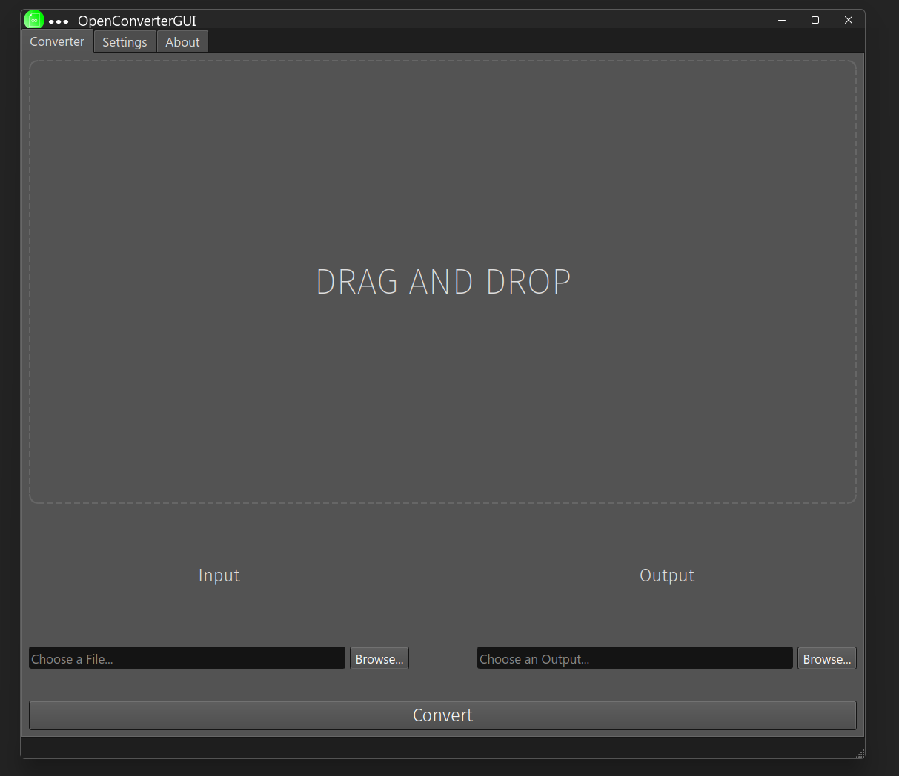
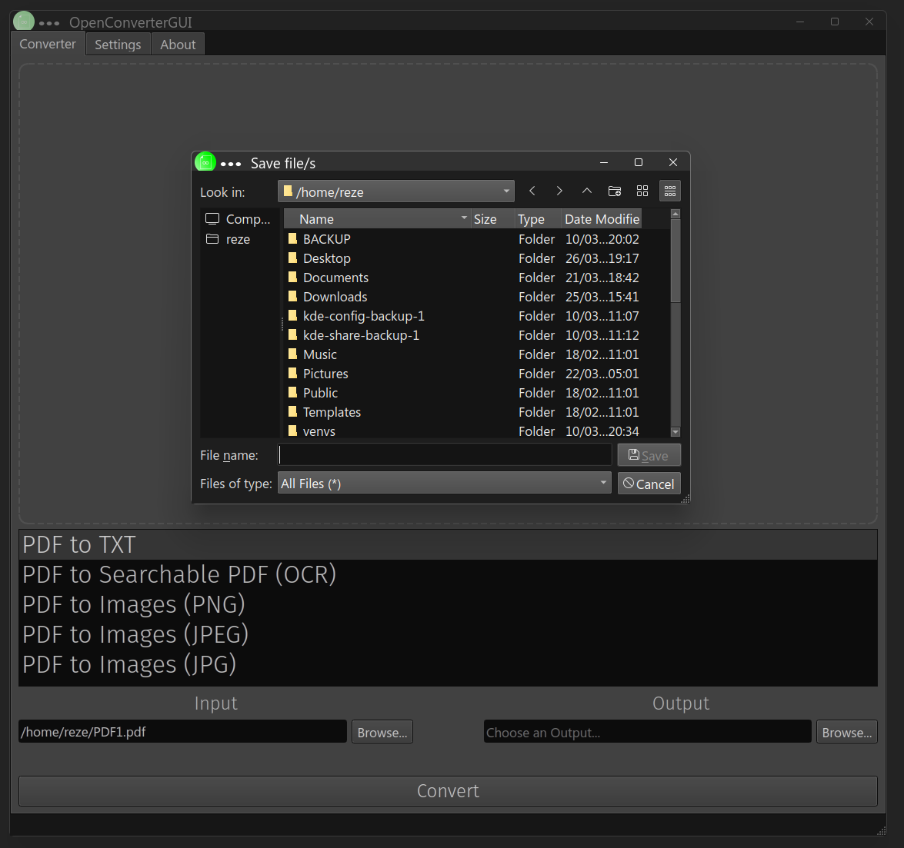

# OpenConverter
**Version: v2.0**

OpenConverter is a simple and lightweight open-source desktop app that allows you to convert:
- PDF → Images (PNG, JPEG, JPG), TXT and Searchable PDF (OCR)
- Images → PDF and Searchable PDF (OCR)
- Office (PPTX, DOCX, XLSX) → PDF
 - TXT → PDF

Built with Python and PyQt6, using various open-sourced libraries.

## Preview



## Requirements:
    - Python 3.7 or higher
    - PyQt6
    - img2pdf
    - pdf2image
    - Pillow
    - Poppler (must be downloaded and added to PATH)
    - PyMuPDF ('fitz')
    - pypdf
    - pytesseract
    
## IMPORTANT
 - PDF → Image conversion requires Poppler.
 - Office → PDF requires LibreOffice to be installed.
It will be detected automatically once installed.
## on Linux (Ubuntu):
 - sudo apt install poppler-utils
 - sudo apt install libreoffice
## on Linux (Arch):
 - sudo pacman -S poppler
 - sudo pacman -S libreoffice
 
## on Windows:
 - Poppler is already bundled with the application, no need to install it manually. (if you have any problems, try downloading Poppler and add it to PATH).
 - You can download LibreOffice from here https://www.libreoffice.org/download/download-libreoffice/
 


## Installation

```bash
git clone https://github.com/ViolinMai/OpenConverter.git
cd OpenConverter
pip install -r requirements.txt
```

## Made by 
 ViolinMai (GitHub)
