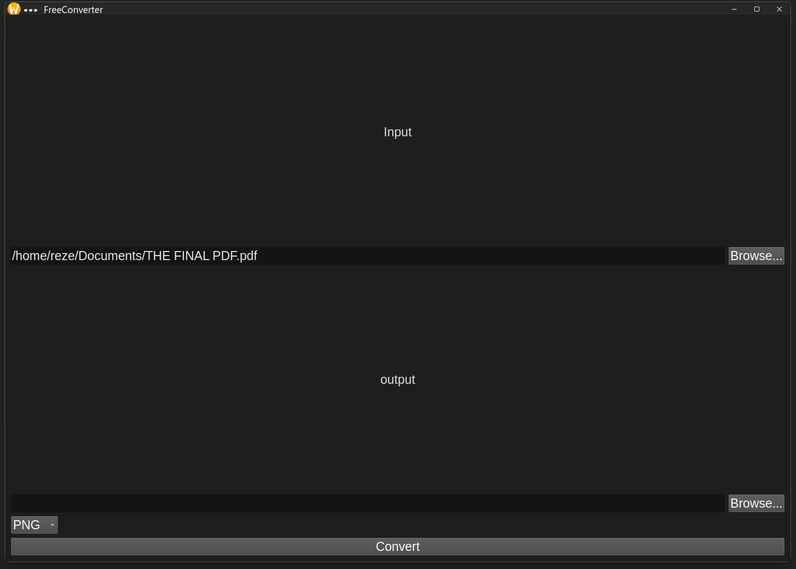
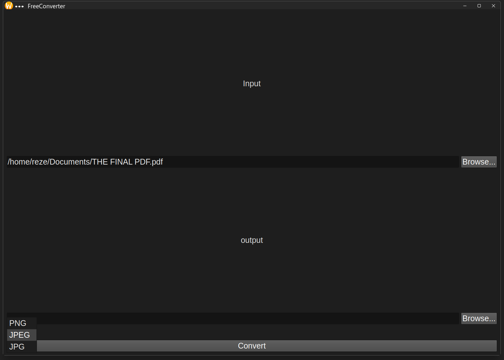
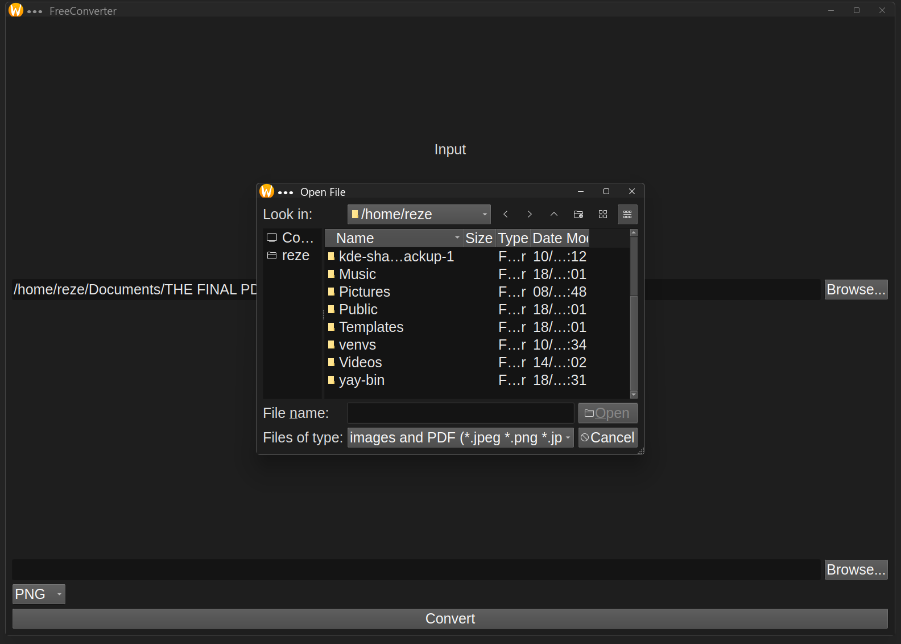

# OpenConverter
**Version: v1.0**

OpenConverter is a simple and lightweight open-source desktop app that allows you to convert:
- PDF → Images (PNG, JPEG, JPG)
- Images → PDF

Built with Python and PyQt5, using img2pdf and pdf2image libraries.

## Preview




## Requirements:
    - Python 3.7 or higher
    - PyQt5
    - img2pdf library
    - pdf2image library
    - Pillow (PIL)
    - Poppler (must be downloaded and added to PATH)
    
## IMPORTANT
PDF to Image conversion requires Poppler.

on Linux (Ubuntu):
 - sudo apt install poppler-utils
on Linux (Arch):
 - sudo pacman -S poppler
on Windows:
 - Download Poppler and add it to PATH.

## Installation

```bash
git clone https://github.com/ViolinMai/OpenConverter.git
cd OpenConverter
pip install -r requirements.txt
```

## Made by 
 ViolinMai (GitHub)
